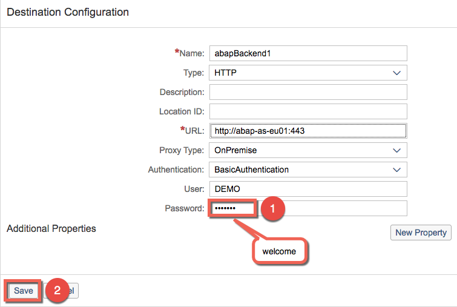
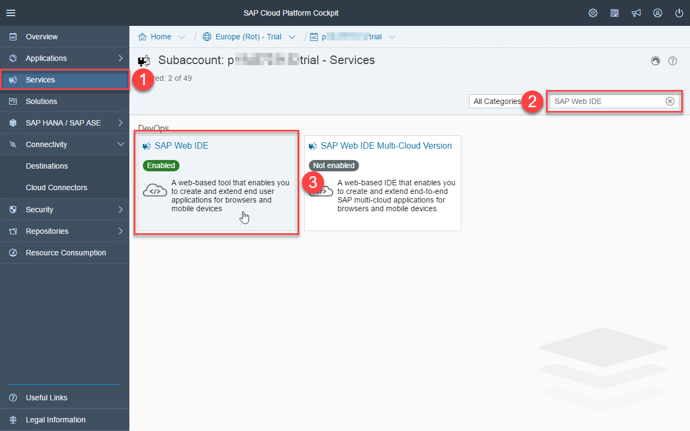

# Exercise 1: Cloud Connector with Neo Environment
In this exercise you will:
1. [Configure Cloud Connector](#configure-cloud-connector)
1. [Import Access Control](#import-acces-control)
1. [Import Destination](#import-destination)
1. [Import Sample Application](#import-application)
1. [Run the App](#run-application)

## 1. Configure Cloud Connector

1. Open Google Chrome.

1. In the bookmarks-bar select **SAP TechEd** > **SAP Cloud Connector**. 

    

1. Login to the Cloud Connector Administrator Interface with the following credentials:
    - **User Name**: `Administrator`
    - **Password**: `welcome`
    - Click **Login**. 

    

1. Define your subaccount:
    - Select **hanatrial.ondemand.com** in the dropdown for **Region Host**
    - Enter your **Subaccount Name**, it should be similar to this `p123456789trial`.
    - Enter your **Subaccount User**, it should be similar to this `P123456789`.
    - Enter your Subaccount User **Password**.
    - Click **Save** 

    

## 2. Import Access Control

1. Click **Cloud To On-Premise** and then the **import icon** (see screenshot blow). 

    

1. Click **Browse**. 

    

1. Select **access_control_a.zip** and click **Open**. 

    

1. Click **Import**. 

    

1. Review that the import was successful. Your screen should look similar to the screenshot below. 

    

## 3. Import Destination

1. Navigate to https://hanatrial.ondemand.com/

1. Login to your account 

    

1. Open the Import-Destination-Dialog
    - Click **Connectivity**
    - Click **Destinations**
    - Click **Import Destination** 

    

1. Select **abapBackend1** and click **Open**. 

    

1. Review that the file was imported correctly and add the password `welcome`. Then click **Save**. 

    

## 4. Import Sample Application

1. Open the SAP Web IDE:
    - Go to **Services**.
    - Search for `SAP Web IDE`.
    - Click the **SAP Web IDE** tile. 

    

1. Click **Go to Services**. 

    

1. Open the Dev-View as shown below. 

    

1. Go to **File** > **Import** > **From File System**. 

    

1. Click **Browse**. 

    

1. Select the file **html5-simple.zip** and click **Open**. 

    

1. Make sure **Import to** is set to `/html5-simple` and click **Ok**. 

    

## 5. Run the App
1. Make sure **html5-simple** is selected, otherwise select it with a single click. Now click the run-icon (see screenshot). 

    

1. You should now see our Demo-Application with data from the ABAP-Backend. 

    
