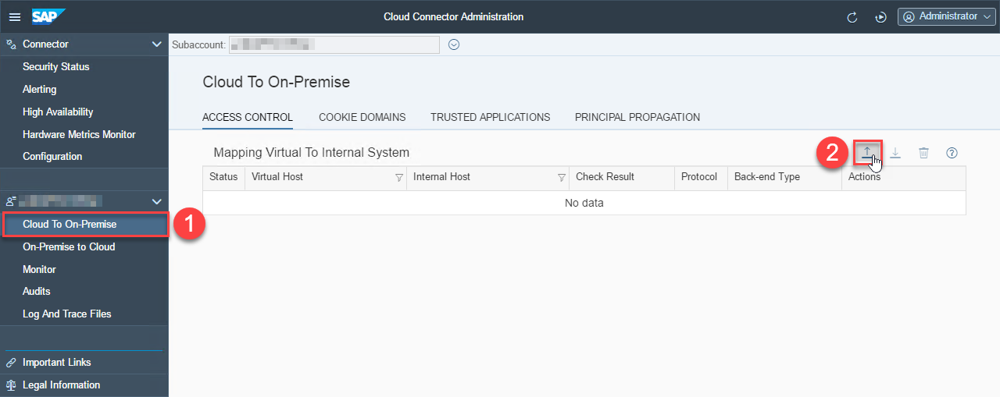
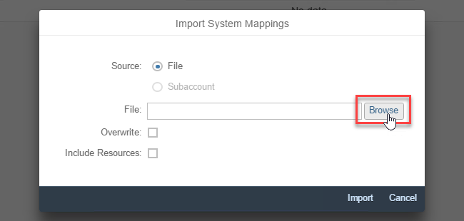
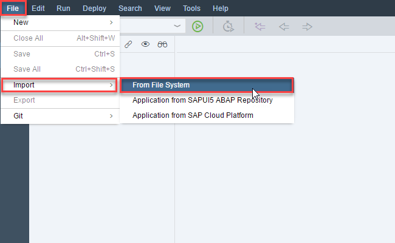
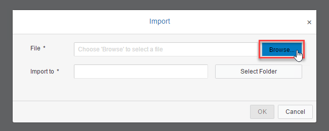

# Exercise 2: Two Cloud Connectors with Neo Environment

## Install a second Cloud Connector

1. Go to https://tools.hana.ondemand.com/#cloud and download the **Cloud Connector** for **Windows (Portable)**. 

    

1. Click **I Have Read And Agree** to start the download.

    

1. After the download has finished, open the file by clicking in the bottom left of the browser. 

    

1. Select **Extract To**. 

    

1. In the upcoming dialog enter `C:\Users\student\Desktop\scc-portable` as destination path and click **OK**. 

    

1. Right-click the Windows icon in the bottom left (see screenshot) und select **Command Prompt** . 

    

1. In the Command Prompt enter `cd Desktop\scc-portable` followed by `changeport.bat 9090` and finally `go.bat`. Now wait until you see the message **Cloud Connector 2.10.1 started on https:<i></i>//localhost:9090**. 

    

## Configure second Cloud Connector

1. Open the URL https://localhost:9090 in Chrome.

  > If you see a message **This page isn’t working** together with the error **ERR_INVALID_HTTP_RESPONSE** you have probably entered <b>http</b>://localhost:9090 instead of <b>https</b>://localhost:9090 in the address-bar.

1. Click **ADVANCED**. 

    

1. Click **Proceed to localhost (unsafe)**. 

    

1. Login with `Administrator` and Password `manage`. 

    

1. Enter the current Password again (`manage`) and choose a new one. We recommend to use `welcome` (same as the first Cloud Connector Instance). Press **Save**. 

    

  > Note: you'll do pretty much the same as in [Exercise 1](../ex1/README.md) with one important difference: This time you'll additionally have to configure a Location ID.

1. Define your subaccount:
    - First Subaccount:
      - Select **hanatrial.ondemand.com** in the dropdown for **Region Host**
      - Enter your **Subaccount Name**, it should be similar to this `p123456789trial`.
      - Enter your **Subaccount User**, it should be similar to this `P123456789`.
      - Enter your Subaccount User **Password**.
      - Enter **Location ID**: `SCC-US`
    - HTTPS Proxy
      - Host: `proxy`
      - Port: `8080`
    - Click **Save** 

    

1. Dismiss the upcoming message by clicking **OK**.

## Import Access Control

1. Click **Cloud To On-Premise** and then the **import icon** (see screenshot blow). 

    

1. Click **Browse**. 

    

1. Select **access_control_b.zip** and click **Open**. 

    

1. Click **Import**. 

    

1. Click the edit icon of the imported mapping (see screenshot below). 

    

1. Change the **Internal Host** to the hostname of your neighbor and click **Save**. 

    

1. After changing the **Internal Host** to the hostname of your neighbor verify with the connection check button that you had no typos and your CLoud Connector can reach his ABAP system. 

    

## Import Destination

1. Go back to the Cockpit.

1. Open the Import Destination Dialog
    - Click **Connectivity**
    - Click **Destinations**
    - Click **Import Destination** 

    

1. Select **abapBackend2** and click **Open** 

    

1. click **Save**. 

## Import Sample Application

1. Go back to SAP Web IDE.

1. Go to **File** > **Import** > **From File System**. 

    

1. Click **Browse**. 

    

1. Select the file **html5-complex.zip** and click **Open**. 

    

1. Make sure **Import to** is set to `/html5-complex` and click **Ok**. 

    

## Run the App
1. Make sure **html5-complex** is selected, otherwise select it with a single click. Now click the run-icon (see screenshot). 

    

1. You should now see our Demo-Application with data from two ABAP-Backends. 

    
