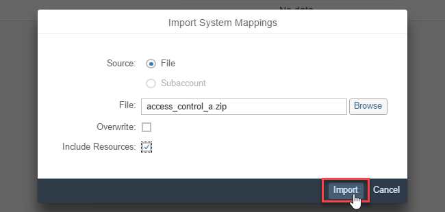
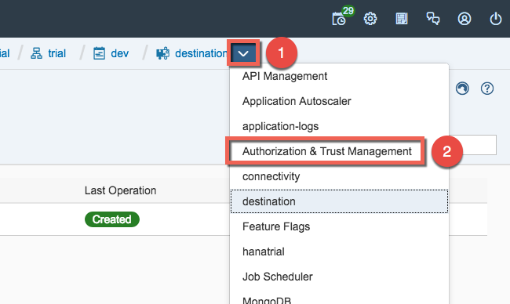
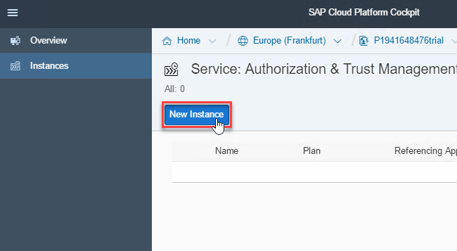

# Exercise 3: Cloud Connector on CF Environment

## Configure Cloud Connector

1. Go back to the SAP Cloud Platform Cockpit.

1. Click **Home**. 

    

1. Click **Go to Cloud Foundry Trial**. 

    

1. In the upcoming dialog select the right **Region** based on you location and then click **OK**. (Use the **US East (VA)** for TechEd Las Vegas and **Europe (Frankfurt)** for TechEd Bangalore and Barcelona).

    

1. After some seconds your CF-trial-subaccount is created. Click **Go to Space**. 

    

1. From your space navigate to the global-account-level. 

    

1. Click the show details icon (see screenshot). 

    

1. Copy your **ID**. 

    

1. Go back to the Cloud Connector Administrator Interface.

1. Click **Add Subaccount**. 

    

1. Define your subaccount:
    - Select **cf.us10.hana.ondemand.com** in the dropdown for **Region Host**
    - Paste the ID you just copied in the cockpit as **Subaccount Name**.
    - Enter your **Subaccount User**, for cloud foundry environment it is the email address, which should be similar to `cpl618-XXX@teched.cloud.sap`.
    - Enter your Subaccount User **Password**.
    - Click **Save** 

    

## Import Access Control

1. Select the newly added subaccount in the overview-page.
    

1. Click **Cloud To On-Premise** and then the **import icon** (see screenshot blow). 

    

1. Click **Browse**. 

    

1. Select **access_control_a.zip** and click **Open**. 

    

1. Click **Import**. 

    

1. Review that the import was successful. You screen should look similar to the screenshot below. 

    

## Create Connectivity Service Instance

1. Go back to the SAP Cloud Platform Cockpit

1. Navigate into your subaccount. 

    

1.  Navigate into your **dev** space. 

    

1. Open the **Service Marketplace**. 

    

1. Find and click the **connectivity** tile. 

    

1. Click **Instances** followed by **New Instance**. 

    

1. Press **Next** three times. 

    

1. Enter the **Instance Name**: `connectivity-demo-lite` and click **Finish**. 

    

## Create XSUAA Service Instance

1. Click the arrow next to **connectivity** (see screenshot) and select **xsuaa**. 

    

1. Click **New Instance**. 

    

1. Press **Next** only once.

1. Press **Browse**.

    

1. Select the **xsuaa-parameters.json** file and press **Open**.

    

1. Verify that the json was loaded successfully (see screenshot) and click **Next** twice.

    

1. Enter the **Instance Name**: `xsuaa-demo` and click **Finish**. 

    

## Create Application Manifests

1. Open the students share and drag the files **connectivity-app-demo-manifest.yml** and **approuter-manifest.yml** to your Desktop. This will create a local copy of the files. 

    

1. Right-click the **connectivity-app-demo-manifest.yml** file on your **Desktop** and select **Edit with Notepad++**. 

    

1.  Add your username as suffix to the host as highlighted in yellow in the screenshot and click the save icon.

    

1. Right-click the **approuter-manifest.yml** file on your **Desktop** and select **Edit with Notepad++**. 

    

1.  Add your username as suffix to the host and the destination-url as highlighted in yellow in the screenshot and click the save icon.

    

## Deploy the Approuter

1. Back in the Browser click the **dev**-space, **Applications** followed by **Deploy Application**. 

    

1. Click **Browse** and select **approuter.zip** as **File Location**. Now **Browse** to select the **Manifest Location** and select the **approuter-manifest.yml** from your Desktop and click **Deploy**. 

    

## Deploy and test the Application

1. Click **Deploy Application** once again.

1. Click **Browse** and select **connectivity-app-demo.war** as **File Location**. Now **Browse** to select the **Manifest Location** and select the **connectivity-app-demo-manifest.yml** from your Desktop and click **Deploy**. 

    

1. Wait until both your applications show a green **Started** as State and then click on **approuter-demo**. 

    

1. Navigate to the Approuter by clicking the link as shown in the screenshot. 

    

1. Login using the E-Mail-Address and password of your trial account. 

    

1. Replace `/index.html` with `/app/` in the address-bar of the browser.

    

1. Once again you should now see our app with data from you local ABAP-system.

    
